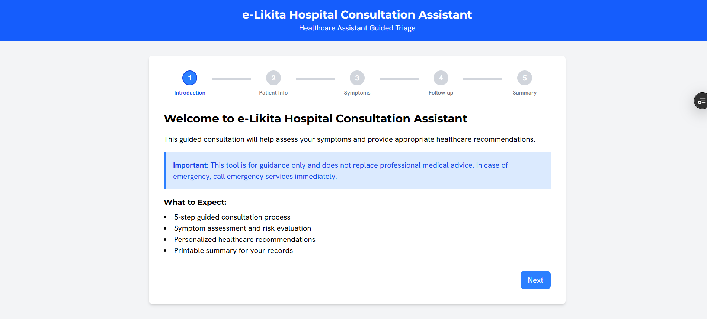
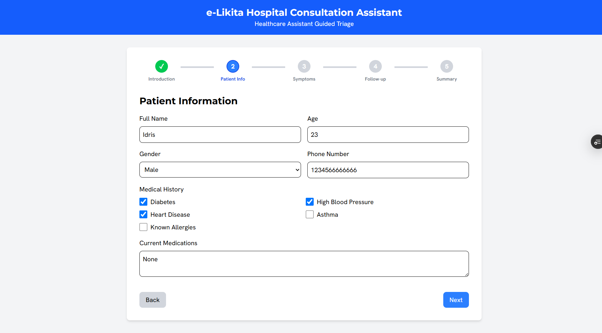
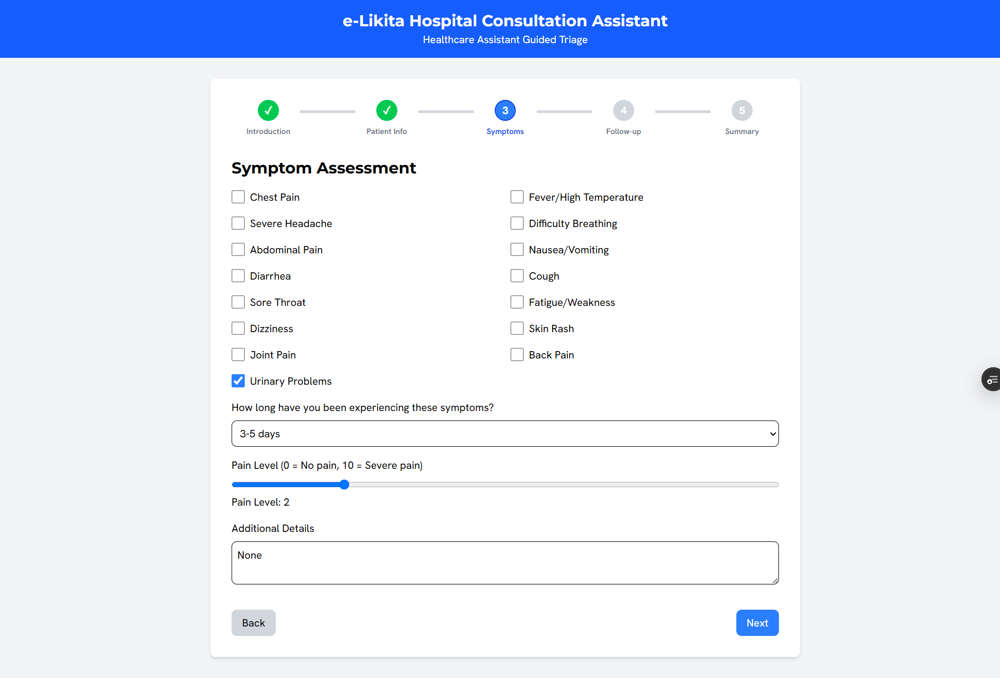
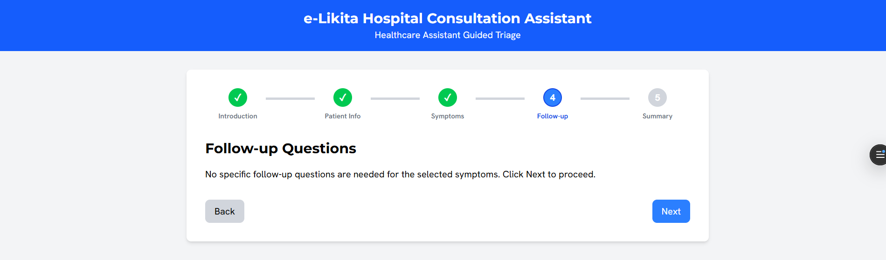
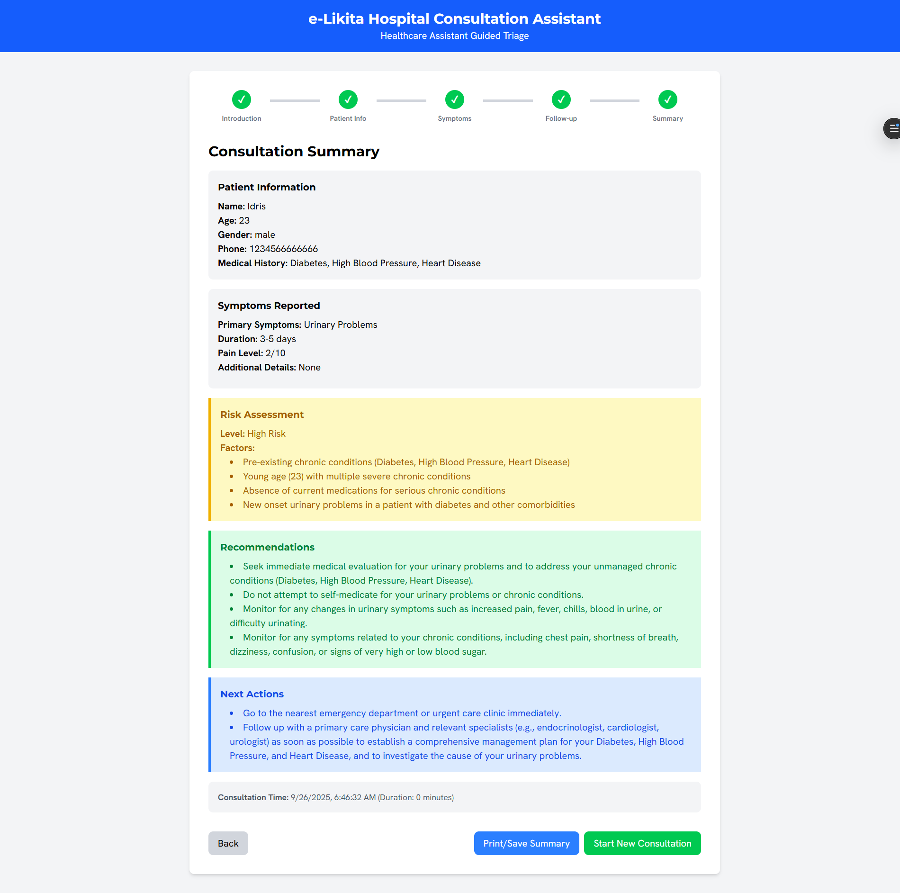

# e-Likita Frontend

e-Likita is a web-based hospital consultation assistant that guides patients through a multi-step triage process. Built with React, TypeScript, and Vite, it assesses symptoms, provides risk evaluation, and offers personalized healthcare recommendations. The application features a user-friendly, responsive interface and generates a printable summary for patient records.

## Features

*   **Guided Consultation:** A 5-step process with a visual stepper to track progress.
*   **AI-Powered Recommendations:** Connects to an AI-powered backend to generate intelligent risk assessments and care recommendations based on the patient's symptoms and data.
*   **Symptom Assessment:** Allows users to select from a list of common symptoms.
*   **Urgency Detection:** Identifies urgent symptoms and advises immediate medical attention.
*   **Dynamic Follow-up Questions:** Asks relevant, symptom-specific follow-up questions based on user input.
*   **Consultation Summary:** Displays a comprehensive summary of the consultation, including patient information, symptoms, AI-generated risk assessment, and recommendations.
*   **Printable Summary:** Allows users to print or save the consultation summary.
*   **Responsive Design:** Fully responsive interface that works on both desktop and mobile devices.

## Screenshots

| Introduction | Patient Information |
| :---: | :---: |
|  |  |

| Symptoms Assessment | Follow-up Questions |
| :---: | :---: |
|  |  |

| Consultation Summary |
| :---: |
|  |

## Getting Started

These instructions will get you a copy of the project up and running on your local machine for development and testing purposes.

### Prerequisites

*   Node.js and npm (or yarn) installed on your machine.

### Installing

1.  Clone the repository:
    ```bash
    git clone https://github.com/Elmoustafi-22/e-likita-frontend.git
    ```
2.  Navigate to the project directory:
    ```bash
    cd e-likita-frontend
    ```
3.  Install the dependencies:
    ```bash
    npm install
    ```

### Running the Application

To run the application in development mode, use the following command:

```bash
npm run dev
```

This will start the development server, and you can view the application in your browser at `http://localhost:5173`.

## Project Structure

The project is structured as follows:

```
e-likita-frontend/
├── src/
│   ├── assets/
│   ├── components/
│   │   ├── FollowUps.tsx
│   │   ├── Introduction.tsx
│   │   ├── PatientInfo.tsx
│   │   ├── Stepper.tsx
│   │   ├── Summary.tsx
│   │   └── Symptoms.tsx
│   ├── types/
│   │   └── index.ts
│   ├── utils/
│   │   └── api.ts
│   ├── App.tsx
│   ├── index.css
│   └── main.tsx
├── .gitignore
├── index.html
├── package.json
├── README.md
└── vite.config.ts
```

*   **`src/assets`**: Contains static assets like images and icons.
*   **`src/components`**: Contains the React components used in the application.
*   **`src/types`**: Contains the TypeScript type definitions.
*   **`src/utils`**: Contains utility functions, such as the API client.
*   **`src/App.tsx`**: The main application component that handles the routing and state management.
*   **`src/index.css`**: The main stylesheet for the application.
*   **`src/main.tsx`**: The entry point of the application.

## Technologies Used

*   **React:** A JavaScript library for building user interfaces.
*   **TypeScript:** A typed superset of JavaScript that compiles to plain JavaScript.
*   **Vite:** A fast build tool and development server for modern web projects.
*   **Tailwind CSS:** A utility-first CSS framework for rapid UI development.
*   **Axios:** A promise-based HTTP client for the browser and Node.js.
*   **React Icons:** A library of popular icons for React projects.

